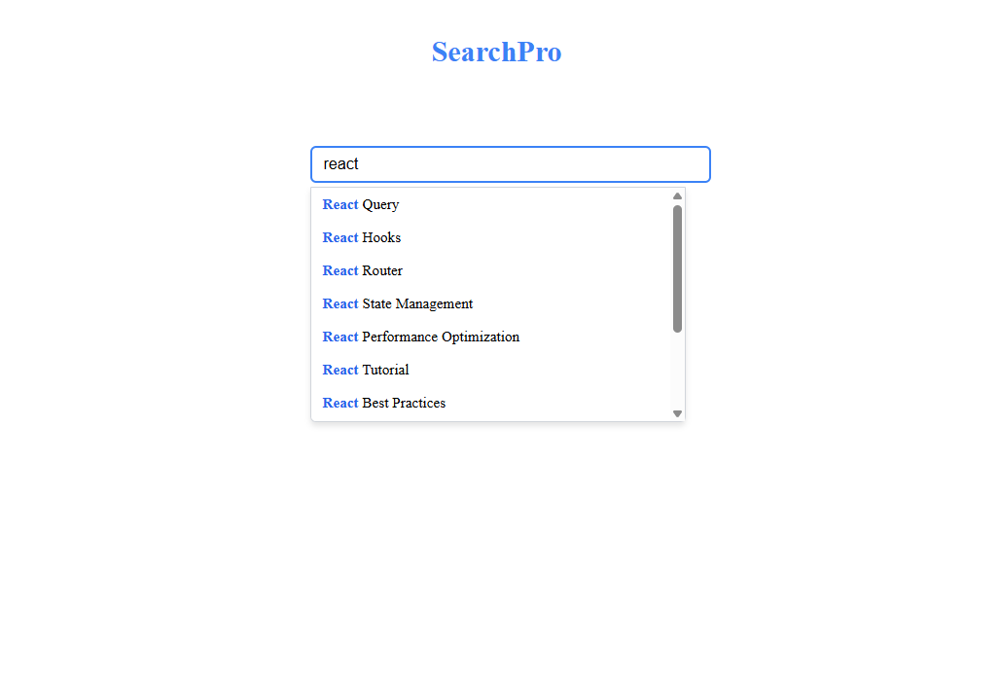

**Task Details:**

- Filter the data based on user input.
- Display the filtered items as shown in the provided image.
- Implement debouncing (300ms) to optimize filtering.
- Highlight the matched substring in bold, while keeping the rest of the text in normal font weight.
- Utilize an LRU Cache (Least Recently Used).
- The cache should store up to 10 items for optimized performance.

# SearchPro

A React-based search bar component with autocomplete functionality, debounce, and caching using an LRU cache for optimized repeated searches.

## Features

- **Autocomplete Suggestions:** Displays filtered suggestions as the user types.
- **Debounce:** Delays search execution by 300ms to reduce unnecessary filtering.
- **LRU Cache:** Caches previous search results to improve performance on repeated queries.
- **Highlight Matching Text:** Highlights the part of the suggestion that matches the query.
- **Clear Input Button:** Allows clearing the current search query.
- **Click Outside to Close:** Clicking outside the input closes the suggestion dropdown.
- **Keyboard Accessible:** Focus management and interaction supported.

## Demo Screenshot

  

## Installation

1. Clone the repository or copy the component files.

2. Install dependencies if this is part of a React project:

- **cd react-assignment**
- **npm install**
- **npm run dev**
